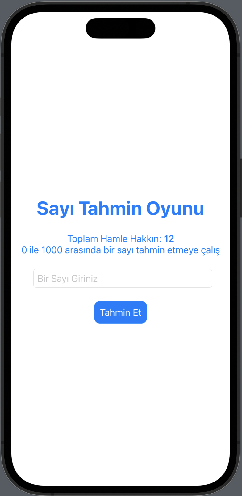
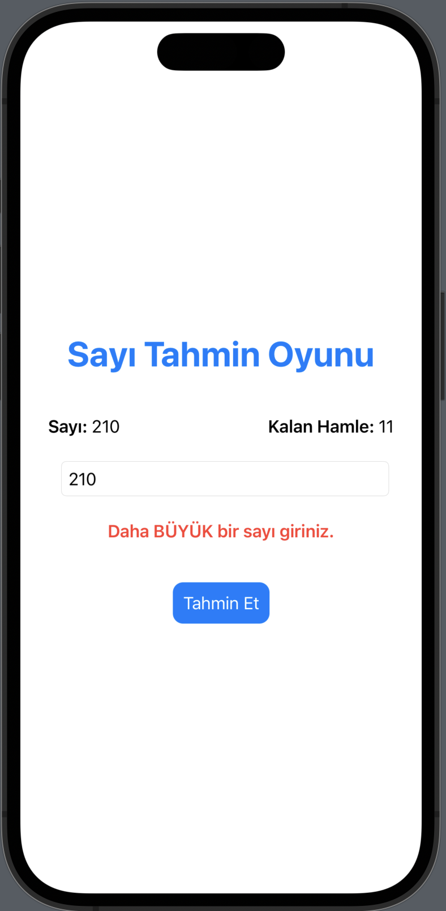
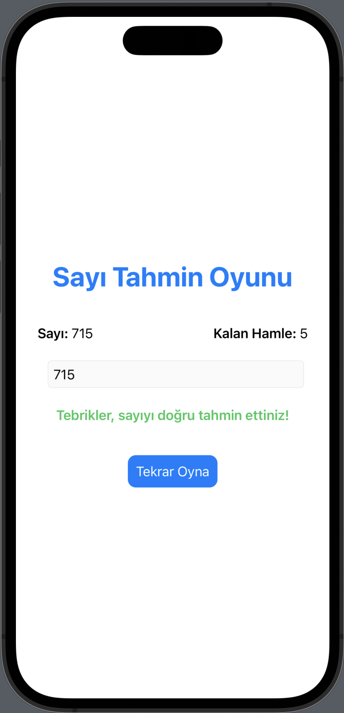

# Sayı Tahmin Oyunu

Bu uygulama, 0 ile 1000 arasında rastgele bir sayı tutar ve kullanıcının bu sayıyı tahmin etmesini ister. Kullanıcı, her seferinde bir sayı girebilir ve uygulama, kullanıcının girdiği sayıya göre tahminin daha büyük veya daha küçük olması gerektiği yönünde geri bildirimde bulunur. Kullanıcının tahmini doğruysa oyun kazanılır.

## Kullanım

1. Uygulamayı başlatın.
2. Rastgele bir sayı seçilir ve kullanıcıdan sayı tahmini yapması istenir.
3. Kullanıcı, bir sayı girer ve uygulama geri bildirimde bulunur.
4. Eğer kullanıcının tahmini doğruysa, oyun kazanılır.
5. Eğer kullanıcının tahmini yanlışsa, uygulama geri bildirimde bulunur ve kullanıcının yeni bir tahmin yapması istenir.
6. Kullanıcının 12 hamle hakkı vardır. Eğer kullanıcı 12 hamle içinde sayıyı bulamazsa, oyun kaybedilir.

## Özellikler

- 0 ile 1000 arasında rastgele sayı tutar.
- Kullanıcının girdiği sayıya göre geri bildirimde bulunur.
- Kullanıcının tahmini doğruysa, oyun kazanılır.
- Kullanıcının tahmini yanlışsa, kullanıcının yeni bir tahmin yapması istenir.
- Kullanıcının 12 hamle hakkı vardır.
- Yeniden oyna özelliği mevcuttur.

## Kullanılan Teknolojiler

- SwiftUI

## Ekran Görüntüleri

  
   
  

## Geliştirici

Fatih Şükran - [@fatih-sukran](https://github.com/fatih-sukran)
